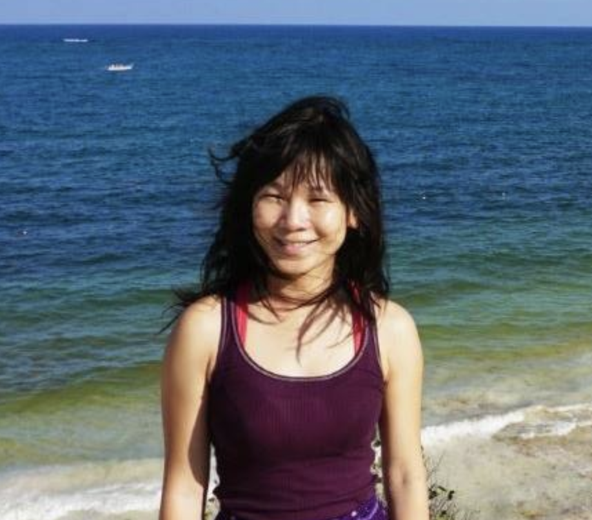

Hi there, thanks for visiting my site!  

I'm a data scientist and math enthusiast. Check out my [portafolio]() for some cool projects, or my [blog](https://sealoving.github.io/) to read more.

Before transitioning to data science, I received a B.S. in Mathematics and a Ph.D in Civil Engineering. My primary field of study was numerical methods for geomorphology and coastal engineering. Here is a list of my peer-reviewed [publications](https://scholar.google.com/citations?user=N08QGhsAAAAJ&hl=en).

In my spare time, I enjoy photography, especially [underwater photography](https://www.sealoving.com). I'm also certified to dive with and without a tank (SCUBA/freediving).

### In My Toolbox
Python, Matlab, SQL, Java  
Machine Learning, Geomorphology, Computational Fluid Dynamics, Hydrology  
Delft3D, ArcGIS, Excel, Tableau, Photoshop  
Underwater and Aerial photography

### Contact me

The best way to contact me is to use the email link below.
